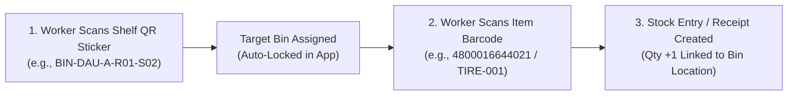

# Mobile Barcode & Bin Location System Implementation Guide for ERPNext

## Executive Overview
This guide outlines the architecture, setup, and operational workflows for implementing a **Mobile Phone-based Barcode and Bin Location (Aisle / Rack / Shelf / Slot) System** in ERPNext.

With this system, warehouse staff, storekeepers, and branch technicians can use standard smartphones (or wireless pocket scanners) to perform real-time:
1. **Goods Receiving & Put-Away**: Assign incoming stock to specific shelf/rack bin locations.
2. **Bin-to-Bin Stock Movements**: Transfer items between aisles, racks, and warehouse tiers.
3. **Guided Order Picking**: Locate exact shelf locations for Sales Orders, Pick Lists, and Vehicle Job Orders.
4. **Physical Stock Audits**: Scan shelf QR codes to reconcile physical inventory against ERP stock balances on the spot.

---

## 1. System Architecture & Labeling Structure

### Physical Hierarchy
```
[WAREHOUSE] (e.g. Ultra MRF Warehouse Dau / Automan Central)
   └── [ZONE / AISLE] (e.g. Zone A - Tires, Zone B - Oils & Lubricants)
         └── [RACK / SECTION] (e.g. Rack 01)
               └── [SHELF / LEVEL] (e.g. Tier 02)
                     └── [BIN CODE]: DAU-A-R01-S02  <--- Physical QR/Barcode Label on Shelf
```

### 2-Step Put-Away Workflow


---

## 2. Hardware & Scanning Options

| Scanning Method | Technology | Operational Speed | Ideal Workflow | Hardware Cost |
| :--- | :--- | :--- | :--- | :--- |
| **Option 1: Mobile Camera (Native Frappe)** | Smartphone Camera via Browser / Frappe App | 1–2 sec / scan | Ad-hoc receipt, small batch receiving | ₱0 (Use existing smartphones) |
| **Option 2: Mobile Web PWA Scanner** | HTML5 Camera Stream (`html5-qrcode`) | 0.5–1 sec / scan (Continuous) | Branch receiving, vehicle bay parts tagging | ₱0 (Use existing smartphones) |
| **Option 3: Phone + Bluetooth Pocket / Ring Scanner** | Bluetooth HID Keyboard Emulation | **< 0.2 sec / scan (Instant)** | High-volume picking, large warehouse dispatch | ~₱1,500 – ₱3,500 per scanner |

---

## 3. Master Data Setup in ERPNext

### A. Item Barcodes (`Item` Master)
1. Go to **Stock > Items > Item**.
2. Scroll to the **Barcodes** table.
3. Configure:
   - **Barcode**: Scan or type the item code / manufacturer EAN (e.g., `8808563384912`).
   - **Barcode Type**: `EAN-13`, `Code 128`, `UPC-A`, or `QR Code`.
   - **UOM**: Unit of Measure (e.g., `Nos`, `Set`, `Box`, `PC`).

### B. Bin Locations (`Bin Location` DocType)
1. Go to **Vehicle Management > Bin Location** (or **Stock > Bin Location**).
2. Create location master records with naming convention:
   - **Bin Location Code**: `DAU-TIRE-R01-S01`
   - **Warehouse**: `Ultra MRF Warehouse Dau`
   - **Company**: `Ultra MRF Warehouse Dau`
   - **Zone**: `Tires & Wheels`
   - **Rack**: `R01`
   - **Shelf**: `S01`
   - **Barcode Tag**: `BIN-DAU-TIRE-R01-S01`

---

## 4. Barcode Label Generation & Thermal Printing

### Standard Thermal Label Format (50mm x 25mm / 50mm x 30mm)

#### 1. Shelf / Bin QR Code Label
```html
<div style="text-align: center; width: 50mm; height: 30mm; padding: 3mm; font-family: sans-serif;">
  <div style="font-weight: 800; font-size: 13px; color: #111;">{{ doc.warehouse }}</div>
  <div style="font-weight: 700; font-size: 14px; margin: 2px 0; color: #1a56db;">{{ doc.bin_location_name }}</div>
  <!-- QR Code generation -->
  
  <div style="font-size: 10px; color: #555;">Zone: {{ doc.zone or '-' }} | Rack: {{ doc.rack or '-' }} | Shelf: {{ doc.shelf or '-' }}</div>
</div>
```

#### 2. Item Barcode Label
```html
<div style="text-align: center; width: 50mm; height: 30mm; padding: 2mm; font-family: sans-serif;">
  <div style="font-weight: 700; font-size: 11px; white-space: nowrap; overflow: hidden;">{{ doc.item_name[:26] }}</div>
  <div style="font-size: 10px; color: #666;">Code: {{ doc.item_code }}</div>
  <!-- Code 128 Barcode generation -->
  
  <div style="display: flex; justify-content: space-between; font-size: 10px; padding: 0 4mm;">
    <span>Bin: <strong>{{ doc.default_bin_location or 'Unassigned' }}</strong></span>
    <span><strong>₱ {{ "{:,.2f}".format(doc.standard_rate or 0) }}</strong></span>
  </div>
</div>
```

---

## 5. Core Operational Workflows

### Workflow 1: Receiving & Put-Away (Stock-In)
```
1. Delivery truck arrives at warehouse / branch.
2. Warehouse staff opens "Stock Entry (Material Receipt)" or "Purchase Receipt" on smartphone.
3. Staff walks to destination aisle / rack.
4. SCAN 1: Scans Shelf QR sticker -> Target Bin Location is selected.
5. SCAN 2...N: Scans each item's barcode -> Items are added with quantity +1 and tagged to that bin.
6. Submit document -> Stock is formally recorded in ERPNext at that specific bin.
```

### Workflow 2: Guided Picking & Job Order Fulfillment (Stock-Out)
```
1. Service Advisor creates Vehicle Job Order / Pick List.
2. The technician opens the Pick List on mobile:
   - System sorts items by aisle/rack sequence for optimal walking path.
   - Screen displays: "Tire 205/55R16 -> Rack A3, Shelf 2 (DAU-A-R03-S02)".
3. Technician walks to Rack A3 / Shelf 2.
4. Scans the item barcode -> System verifies correct item was pulled and marks row complete.
```

### Workflow 3: Bin-to-Bin Internal Warehouse Movement
```
1. Staff opens "Stock Entry (Material Transfer)".
2. Scan Source Bin (e.g., Receiving Dock) -> Scan Item -> Scan Destination Bin (e.g., Tire Rack B1).
3. Submit -> ERP balances update immediately across shelf dimensions.
```

### Workflow 4: Physical Inventory Audit (Cycle Counting)
```
1. Staff walks to a specific shelf (e.g., DAU-LUB-R02-S01).
2. Scans the shelf QR code on mobile.
3. App lists expected ERP items and quantities currently located on that shelf.
4. Staff scans physical items on the shelf to confirm actual count.
5. If discrepancy is found, app auto-creates a Stock Reconciliation draft for manager approval.
```

---

## 6. Mobile Scanner Client Script (Auto-Detection)

Below is the production-ready client script for mobile barcode scanning with automatic Shelf vs. Item detection:

```javascript
frappe.ui.form.on('Stock Entry', {
    refresh: function(frm) {
        // Add quick camera scan button in mobile header
        if (frappe.is_mobile() || true) {
            frm.add_custom_button(__('Scan Barcode / Shelf'), function() {
                open_mobile_camera_scanner(frm);
            }).addClass('btn-primary');
        }
    }
});

function open_mobile_camera_scanner(frm) {
    const dialog = new frappe.ui.Dialog({
        title: __('Mobile Barcode / Bin Scanner'),
        fields: [
            {
                fieldname: 'scan_stream_html',
                fieldtype: 'HTML',
                options: `
                    <div id="qr-reader" style="width: 100%; max-width: 420px; margin: 0 auto; border-radius: 8px; overflow: hidden;"></div>
                    <div id="scan-status" style="margin-top: 10px; text-align: center; font-weight: 600; font-size: 13px; color: #1a56db;">
                        Point camera at a Shelf QR or Product Barcode
                    </div>
                `
            }
        ],
        primary_action_label: __('Done'),
        primary_action: () => dialog.hide()
    });

    dialog.show();

    // Initialize HTML5 QR/Barcode Reader
    if (window.Html5Qrcode) {
        const html5QrCode = new Html5Qrcode("qr-reader");
        html5QrCode.start(
            { facingMode: "environment" },
            { fps: 15, qrbox: { width: 260, height: 160 } },
            (decodedText) => {
                handle_scanned_barcode(frm, decodedText);
            }
        ).catch(err => {
            $('#scan-status').html(`<span class="text-danger">Camera error: ${err}</span>`);
        });

        dialog.on_hide = () => {
            html5QrCode.stop().catch(() => {});
        };
    }
}

function handle_scanned_barcode(frm, code) {
    code = code.trim();

    // 1. Check if scanned code is a Shelf / Bin Location
    if (code.startsWith("BIN-") || code.startsWith("RACK-") || code.startsWith("SHELF-")) {
        frm.current_target_bin = code;
        frappe.show_alert({
            message: `<strong>Target Bin Set:</strong> ${code}`,
            indicator: 'blue'
        }, 4);
        $('#scan-status').html(`<span style="color: #046c4e;">Active Shelf: <strong>${code}</strong>. Now scan products.</span>`);
        return;
    }

    // 2. Otherwise treat as Product / Item Barcode
    frappe.call({
        method: "erpnext.stock.utils.scan_barcode",
        args: { barcode: code },
        callback: function(r) {
            if (r.message && r.message.item_code) {
                const item = r.message;
                
                // Check if item already exists in table
                let existing_row = (frm.doc.items || []).find(d => d.item_code === item.item_code && (!frm.current_target_bin || d.bin_location === frm.current_target_bin));

                if (existing_row) {
                    frappe.model.set_value(existing_row.doctype, existing_row.name, 'qty', existing_row.qty + 1);
                } else {
                    let row = frm.add_child('items', {
                        item_code: item.item_code,
                        qty: 1,
                        uom: item.uom || 'Nos',
                        bin_location: frm.current_target_bin || ''
                    });
                }
                frm.refresh_field('items');

                frappe.show_alert({
                    message: `Added: <strong>${item.item_code}</strong> (+1) -> ${frm.current_target_bin || 'Default Bin'}`,
                    indicator: 'green'
                }, 3);
            } else {
                frappe.show_alert({ message: `Unknown Barcode: ${code}`, indicator: 'red' }, 3);
            }
        }
    });
}
```

---

## 7. Technical Prerequisites & Security

1. **HTTPS (SSL / TLS Certificate)**:
   - Smartphone browsers (Google Chrome on Android, Apple Safari on iOS) strictly require an HTTPS connection to access the mobile device camera (`navigator.mediaDevices.getUserMedia`).
   - If running on a local IP/port, set up a reverse proxy (Caddy / NGINX) with SSL or an internal domain certificate.
2. **Lighting & Contrast**:
   - For warehouse aisles with low lighting, use white high-durability vinyl matte stickers with black barcodes.
   - 2D QR codes have higher error correction (up to 30% damage/smudge resistance) compared to 1D linear barcodes.
3. **Role & Permission Control**:
   - Restrict Put-Away and Stock movements to `Stock User`, `Stock Manager`, and branch technicians.
   - Cross-branch restrictions ensure branch staff only scan items into bins belonging to their assigned company/warehouse.

---

## 8. Implementation Rollout Checklist

- [ ] **Phase 1: Master Setup**
  - Define warehouse zones, racks, and shelf naming conventions.
  - Populate the `Bin Location` DocType table for all warehouse branches.
  - Verify every stocked Item has a barcode in `tabItem Barcode`.
- [ ] **Phase 2: Physical Labeling**
  - Print shelf QR codes (50mm x 30mm) and paste on all warehouse racks.
  - Print product barcode stickers for unbranded / loose stock.
- [ ] **Phase 3: Hardware & Mobile Testing**
  - Verify camera permissions on Android and iOS devices over HTTPS.
  - Pair test Bluetooth pocket scanners with mobile phones in HID keyboard mode.
- [ ] **Phase 4: Staff SOP Training**
  - Train storekeepers on the 2-step Put-Away scan (Shelf QR -> Item Barcode).
  - Train picking staff on guided bin location retrieval during Job Order processing.
