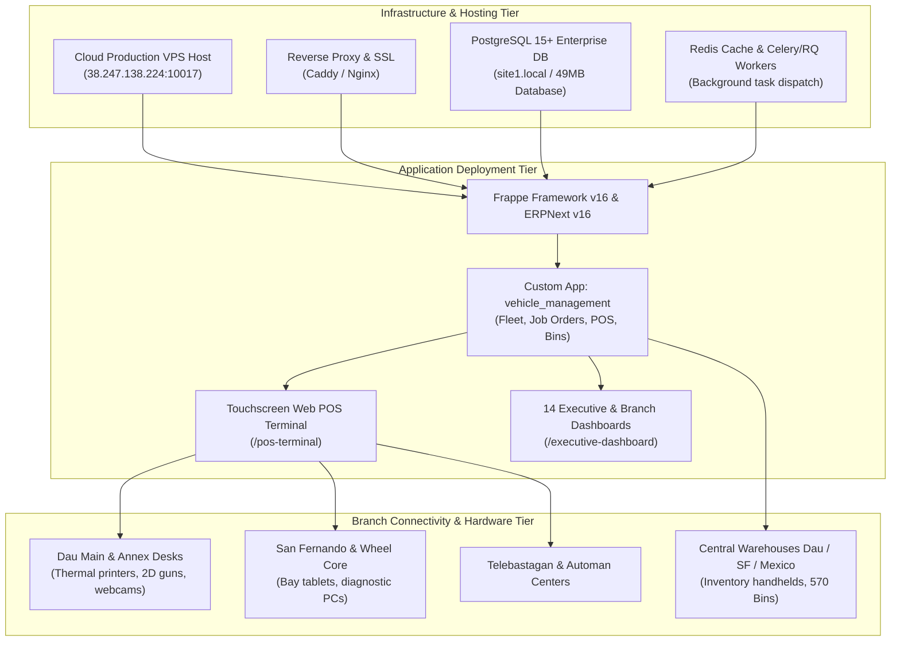
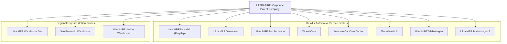
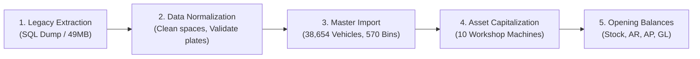
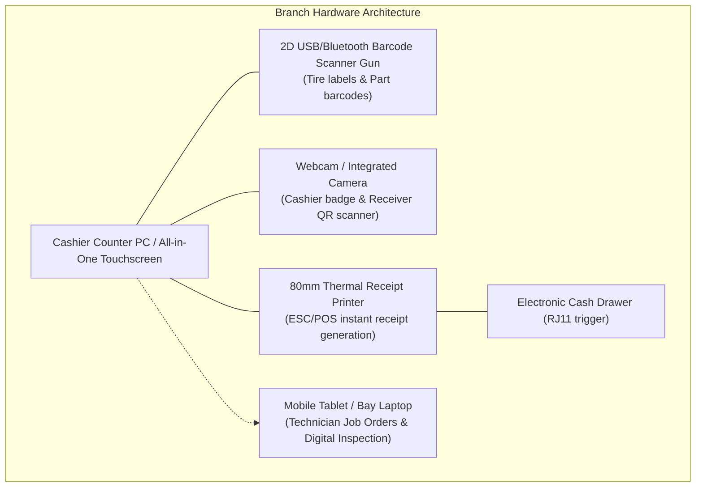
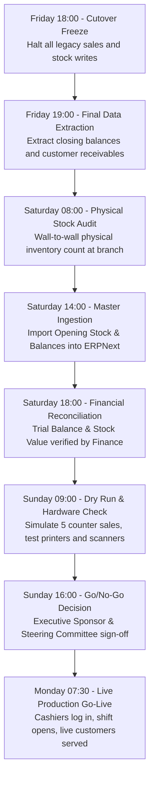
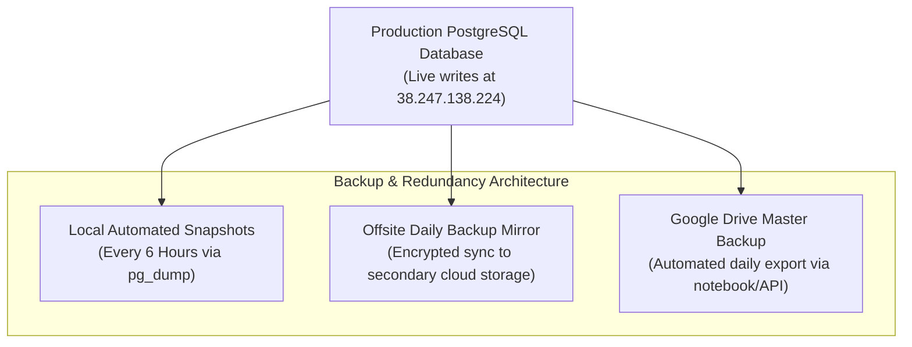

# ERPNext Deployment Implementation Plan for ULTRA MRF

---

## 1. Executive Summary & Deployment Mandate

This **ERPNext Deployment Implementation Plan** governs the end-to-end production deployment and enterprise rollout of **ERPNext v16** and the **Vehicle Management System (VMS)** for **ULTRA MRF**.

The mandate covers the deployment of a centralized, real-time enterprise system across:
* **1 Corporate Headquarters**: `ULTRA MRF`
* **8 Frontline Retail & Automotive Service Centers**: `Ultra MRF Dau Main`, `Ultra MRF Dau Annex`, `Ultra MRF San Fernando`, `Wheel Core`, `Automan Car Care Center`, `The Wheelhub`, `Ultra MRF Telebastagan`, `Ultra MRF Telebastagan 2`.
* **3 Regional Distribution Hubs & Warehouses**: `Ultra MRF Warehouse Dau`, `San Fernando Warehouse`, `Ultra MRF Mexico Warehouse`.



---

## 2. Production Infrastructure & Deployment Topology

### A. Server Specifications & Production Stack
| Layer | Specification / Technology | Operational Role |
| :--- | :--- | :--- |
| **Host Environment** | Linux VPS (Ubuntu 22.04 LTS / Debian 12) | Dedicated cloud server hosting all branch operations |
| **Host IP / Port** | `38.247.138.224:10017` | Public production endpoint |
| **Web Server / Proxy** | Caddy v2 / Nginx | SSL termination, reverse proxy, static asset caching |
| **App Framework** | Frappe Framework v16.x | Meta-data driven application server |
| **ERP Application** | ERPNext v16.x | Core Accounting, Stock, Buying, Selling, Fixed Assets |
| **Automotive App** | `vehicle_management` custom app | Fleet registry, Job Orders, POS, Bin locations |
| **Database Engine** | PostgreSQL 15+ (`site1.local`) | Relational database (`full_restored.sql`, 49MB schema) |
| **In-Memory Cache** | Redis Cache & Redis Queue | Session caching, background worker queue management |
| **Process Supervisor** | Supervisor / Podman Systemd | Process auto-restart and zero-downtime worker orchestration |
| **File Storage** | Local NVMe + Offsite Backup Sync | Stores vehicle inspection photos, QR badges, and documents |

### B. Network & Firewall Configuration
* **Port 80 / 443**: Inbound HTTPS traffic from branch cash registers and executive laptops.
* **Port 10017**: Direct application port reverse-proxied via Caddy.
* **Port 22**: SSH restricted to authorized DevOps IP keys.
* **Port 5432 (PostgreSQL)**: Bound strictly to `localhost` (127.0.0.1) and internal container network. External database access is disabled.

---

## 3. Multi-Company Enterprise Configuration

The deployment configures 12 corporate company records in ERPNext, enforcing multi-company financial isolation while allowing corporate consolidation:



### Configuration Matrix per Company:
1. **Chart of Accounts (COA)**: Standardized Philippine Chart of Accounts template customized with automotive cost centers.
2. **Cost Center Tagging**: Unique cost center assigned per branch (e.g. `UMDM`, `UMDA`, `UMSF`, `WC`, `ACCC`, `TWH`, `UMT`).
3. **Warehouses**: Default warehouse mapped per location (e.g. `Stores - UMDM`, `Stores - UMDA`, `Stores - UMSF`).
4. **POS Profiles**: Dedicated profile per physical cash register specifying company warehouse, payment modes, and price list.
5. **Tax Category**: 12% Philippine Value Added Tax (VAT) configured on sales invoices, POS invoices, and purchase orders.

---

## 4. Master Data Migration & Cutover Deployment

The cutover deployment migrates all verified legacy data into ERPNext with automated data normalization:



### A. Data Ingestion Volumes & Validation Rules:
* **Customer Vehicle Registry (38,654 Records)**:
  * Normalized via `batch_clean_vehicles.py` to eradicate multi-space corruptions (e.g. `"JOAN  CHIIETE"` $\rightarrow$ `"JOAN CHIIETE"`).
  * Validated plate numbers, engine numbers, and chassis/VIN numbers.
  * Relational links confirmed to 38,000+ customer records.
* **Warehouse Bin Locations (570 Records)**:
  * Complete hierarchy: Aisle $\rightarrow$ Rack $\rightarrow$ Shelf $\rightarrow$ Bin slotting.
* **Item Master Catalog**:
  * Tires (TBR, PCR, SUV), alloy wheels, lubricants (motor oil, gear oil, coolant), replacement parts, and labor services.
  * Standard units of measure (PC, SET, LITER, DRUM) and barcodes indexed.
* **Fixed Assets (10 Capitalized Machines)**:
  * Capitalized workshop machinery (3D Wheel Aligners, Tire Changers, Balancers, 2-Post Lifts, AC Stations) with monthly straight-line depreciation schedules.
* **Opening Financial & Stock Balances**:
  * Opening inventory imported via `Stock Reconciliation` per branch warehouse.
  * Opening trade receivables and payables imported via `Opening Journal Entry`.

---

## 5. Branch Hardware & Peripherals Deployment

Each physical branch location is equipped with standardized hardware profiles:



### Hardware Deployment Checklist per Branch:
1. **Network**: Dual ISP broadband connection (Primary Fiber + 4G/LTE Backup Failover).
2. **Cashier Station**:
   * Minimum PC specs: Intel Core i3 / 8GB RAM / 128GB SSD / Windows 10/11 or Ubuntu.
   * Chrome/Edge browser pinned to `http://38.247.138.224:10017/pos-terminal`.
   * Cashier camera tested with `📷 Scan QR Code` modal.
   * Thermal printer configured with custom 80mm ESC/POS print format.
3. **Service Bay Stations**:
   * Android/iOS tablet or rugged laptop accessing `/desk/vehicle-job-order`.
   * Digital camera permissions active for multi-point vehicle intake photos.

---

## 6. Phased Rollout Schedule (14-Week Plan)

The deployment follows a phased rollout to mitigate operational risks across branches:

```mermaid
gantt
    title ULTRA MRF ERPNext Deployment Schedule
    dateFormat  YYYY-MM-DD
    section Wave 1: Pilot & Hub
    Server Setup & PostgreSQL Migration    :done, w1_1, 2026-09-01, 2026-09-10
    Pilot Cutover: Dau Main & Warehouse Dau :active, w1_2, 2026-09-11, 2026-09-25
    section Wave 2: Core Branches
    Dau Annex & San Fernando Cutover       :w2_1, 2026-09-26, 2026-10-10
    Wheel Core & San Fernando Warehouse    :w2_2, 2026-10-05, 2026-10-20
    section Wave 3: Expansion Centers
    Telebastagan 1 & 2 Cutover             :w3_1, 2026-10-21, 2026-11-05
    Automan & The Wheelhub Cutover         :w3_2, 2026-11-01, 2026-11-15
    Mexico Warehouse Integration           :w3_3, 2026-11-10, 2026-11-20
    section Wave 4: Full Enterprise
    Enterprise Review & Hypercare Sign-off :w4_1, 2026-11-20, 2026-12-05
```

### Deployment Waves:
* **Wave 1 (Pilot — Weeks 1 to 4)**:
  * Host infrastructure validation (`38.247.138.224:10017`).
  * Live pilot rollout at `Ultra MRF Dau Main` and central distribution hub `Ultra MRF Warehouse Dau`.
  * Validate high-speed counter POS, warehouse material transfers, and GL posting.
* **Wave 2 (Core Branches — Weeks 5 to 8)**:
  * Rollout to `Ultra MRF Dau Annex`, `Ultra MRF San Fernando`, `Wheel Core`, and `San Fernando Warehouse`.
  * Inter-branch replenishment and stock movement testing.
* **Wave 3 (Expansion Centers — Weeks 9 to 12)**:
  * Rollout to `Automan Car Care Center`, `The Wheelhub`, `Ultra MRF Telebastagan`, `Ultra MRF Telebastagan 2`, and `Ultra MRF Mexico Warehouse`.
  * Enable complete multi-branch executive dashboard consolidation.
* **Wave 4 (Stabilization & Hypercare — Weeks 13 to 14)**:
  * Full production sign-off, SLA governance, and operational handover.

---

## 7. Cutover Weekend Runbook (Minute-by-Minute Protocol)

The final cutover for each branch is executed over a weekend using this exact runbook:



| Timeline | Milestone / Action | Responsible Party | Success Criteria |
| :--- | :--- | :--- | :--- |
| **T-48h (Fri 18:00)** | Freeze legacy billing systems; announce cutover | Project Manager | Legacy systems set to read-only |
| **T-36h (Sat 08:00)** | Physical inventory cycle count across branch bays | Storekeeper / Audit | Signed count variance sheets |
| **T-24h (Sat 14:00)** | Ingest opening stock into `Stores - [BRANCH]` | Technical Architect | `tabBin` actual qty matches audit count |
| **T-16h (Sat 18:00)** | Post opening AR/AP and trial balance journals | Functional Consultant | Balance Sheet debits equal credits |
| **T-12h (Sun 09:00)** | Hardware sanity test: 2D guns, receipt printers | Branch Super User | Test receipt prints without errors |
| **T-4h (Sun 16:00)** | Executive Go/No-Go evaluation meeting | Steering Committee | Formal GO decision approved |
| **T-0 (Mon 07:30)** | Open live cash registers via `POS Opening Entry` | Cashiers / Branch Mgr | First live vehicle serviced & billed |

---

## 8. User Acceptance Testing (UAT) Scripts

Before any branch cutover, staff must pass the following standardized UAT scenarios:

### UAT-01: Front Desk Express POS Counter Sale
* **Tester**: Cashier
* **Steps**:
  1. Open `/pos-terminal`.
  2. Scan Cashier QR ID Badge or type credentials. Verify active shift loads.
  3. Enter customer plate number (e.g. `CAZ4232`). Verify make and model auto-populate.
  4. Toggle **In Stock: ON**. Verify only on-hand branch warehouse items appear.
  5. Add 2 tires and 1 oil filter. Choose payment method: `Cash`. Enter ₱5,000 tender.
  6. Click **Complete Sale**.
* **Expected Result**: System creates `Vehicle POS Invoice`, auto-submits ERPNext `POS Invoice`, decrements `tabBin.actual_qty`, writes General Ledger entries, and prints 80mm receipt with change calculation.

### UAT-02: Workshop Vehicle Job Order Lifecycle
* **Tester**: Service Advisor / Technician
* **Steps**:
  1. Create `Vehicle Inspection` from template. Check tires, brakes, battery. Attach photo.
  2. Create `Vehicle Job Order` in status `Draft`. Add labor (PMS) and parts.
  3. Change status to `In Progress`. Technician executes mechanical work.
  4. Change status to `Completed` and release vehicle.
* **Expected Result**: Job order logs technician labor hours, calculates total parts and labor, and routes to cashier for settlement.

### UAT-03: Material Issue QR Safety Handover
* **Tester**: Warehouse Custodian
* **Steps**:
  1. Create `Stock Entry` (Material Issue) to release 4 tires to Bay 2.
  2. Click **Submit**. Receiver QC modal intercepts.
  3. Technician presents employee QR badge to camera and snaps photo evidence.
  4. Click **Verify & Submit**.
* **Expected Result**: Transaction blocked if badge is invalid; submits cleanly with attached photo proof when badge is verified.

---

## 9. Backup, Disaster Recovery & High Availability

To ensure continuous operation without data loss:



### Backup & Recovery Metrics:
* **Recovery Point Objective (RPO)**: < 6 Hours (maximum potential data exposure in catastrophic hardware failure).
* **Recovery Time Objective (RTO)**: < 1 Hour (server restoration from complete snapshot).
* **Automated Backup Schedule**:
  * **Hot Database Dumps**: Executed every 6 hours (`00:00`, `06:00`, `12:00`, `18:00`).
  * **Nightly Offsite Archive**: Compressed `.dump` files uploaded to offsite storage and Google Drive.
  * **Retention Policy**: Retain 7 daily snapshots, 4 weekly snapshots, and 12 monthly archives.

---

## 10. Post-Deployment Hypercare & Operations Governance

Following production go-live, the system enters a 30-day **Hypercare Period**:

### Support Escalation Hierarchy:
* **Level 1 (Immediate On-Site Support)**: Branch Super User / Lead Cashier resolves minor printer jams, badge scans, or user password resets. Response time: < 15 minutes.
* **Level 2 (ERP Functional Support)**: Functional Consultant resolves invoice cancellations, pricing rule adjustments, or customer credit limit overrides. Response time: < 30 minutes.
* **Level 3 (DevOps & Core Architecture)**: Antigravity Technical Architect handles database lockups, Caddy proxy routing, or code exceptions. Response time: < 1 hour.

### Operational Auditing & SLA Reviews:
* **Daily**: End-of-day POS drawer cash balancing and unsubmitted draft reconciliation.
* **Weekly**: Warehouse cycle count variance audit and stock ledger balance check.
* **Monthly**: Fixed asset depreciation verification, BIR VAT tax summary audit, and executive dashboard financial review.
