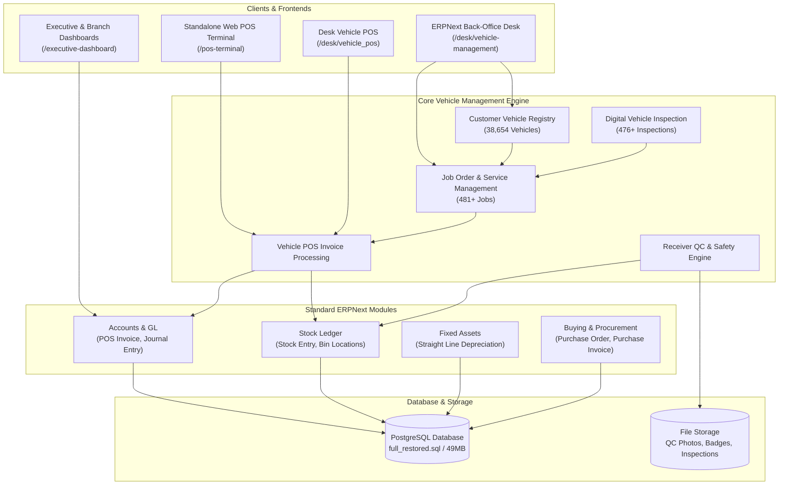
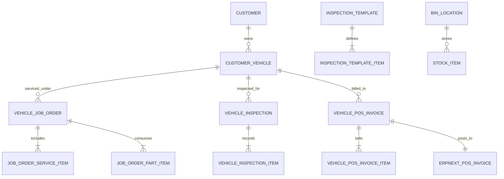
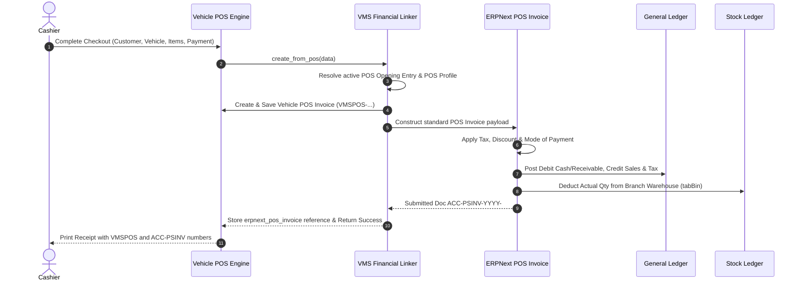
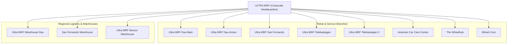
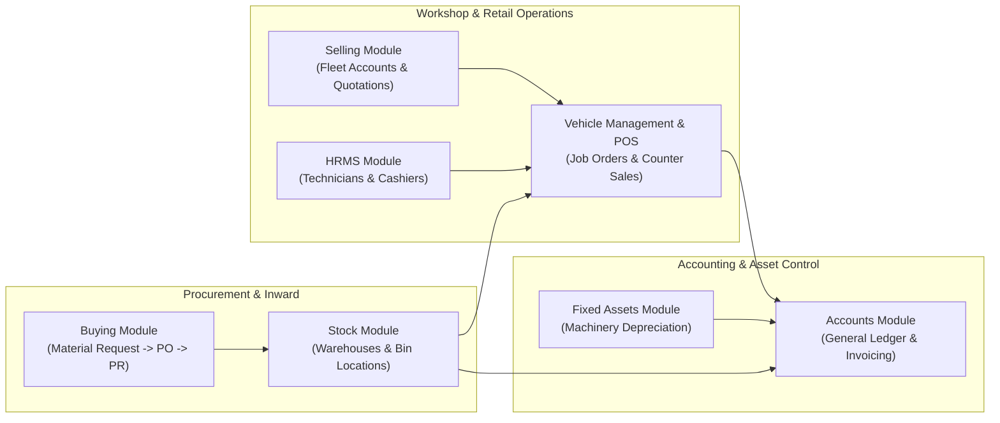
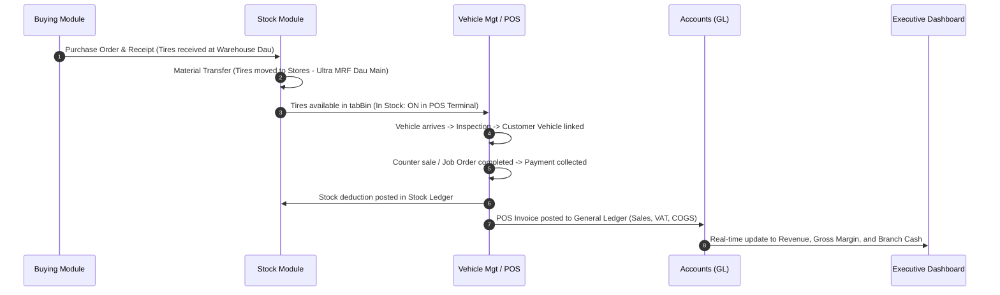
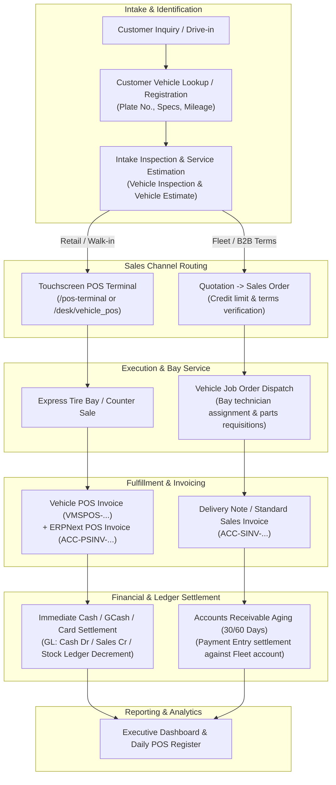
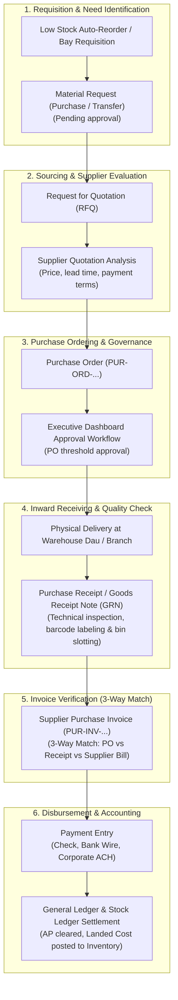
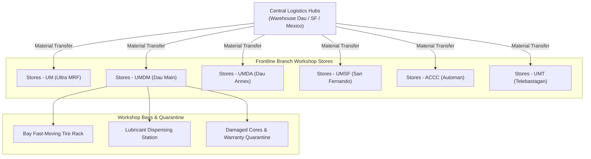

# ERPNext Vehicle Management System (VMS) — Comprehensive Technical & Functional Documentation

---

## Executive Summary

The **ERPNext Vehicle Management System (VMS)** is an enterprise-grade automotive aftermarket, tire retail, and workshop management solution built directly on **ERPNext v16 / Frappe Framework** with a high-performance **PostgreSQL** relational database. 

It unifies multi-branch counter POS sales, vehicle service history, mechanical job order dispatch, digital vehicle inspections, warehouse inventory control, fixed asset depreciation, and multi-company financial reporting into a single real-time platform.



---

# PART I: TECHNICAL SPECIFICATION & ARCHITECTURE

## 1. System Topology & Infrastructure

* **Production Server**: Dedicated Linux VPS (`38.247.138.224:10017`)
* **Web Server & Reverse Proxy**: Caddy / Nginx handling SSL termination and static caching.
* **Application Framework**: Frappe Framework v16 with ERPNext v16.
* **Database Engine**: PostgreSQL 15+ (`site1.local`), configured with relational integrity, JSONB support, and full transaction isolation.
* **Custom App**: `vehicle_management` (`/frappe-bench/apps/vehicle_management`).
* **Python Runtime**: Python 3.11 with `numpy`, `pillow`, `barcodenumber`, `frappe` typing validations.

### Primary Endpoint Mapping
| Resource | URL Path | Type | Target Technology |
| :--- | :--- | :--- | :--- |
| **Desk Admin** | `/desk` | Desk SPA | Frappe Desk v16 |
| **Vehicle Management Workspace** | `/desk/vehicle-management` | Desk Workspace | EditorJS + Frappe Charts & KPI Cards |
| **Vehicle Analytics Dashboard** | `/desk/vehicle_analytics` | Custom Page | jQuery + Frappe Call + Chart.js |
| **Desk Vehicle POS** | `/desk/vehicle_pos` | Custom Page | Touchscreen POS SPA inside Desk |
| **Standalone POS Terminal** | `/pos-terminal` | Standalone Web Page | Vanilla JS + WebRTC Camera Scanner + SVG Badges |
| **Executive Master Dashboard** | `/executive-dashboard` | Web Page CMS | Responsive Vanilla JS + SVG Analytics + Direct Desk Routing |
| **Company Executive Dashboards** | `/executive-[company-slug]` | Web Page CMS | 12 Dedicated Company Dashboards |

---

## 2. Database Schema & Custom DocTypes

The `vehicle_management` application introduces a suite of interconnected automotive DocTypes:



### A. `Customer Vehicle`
* **Purpose**: Core asset registry for all vehicles serviced across branches.
* **Table**: `tabCustomer Vehicle` (38,654 active records).
* **Key Fields**:
  * `license_plate` (Data, Unique): Vehicle registration plate (e.g., `CAZ4232`, `0301 650263`).
  * `customer` (Link -> `Customer`): Registered owner.
  * `customer_name` (Data): Normalized owner name.
  * `make` (Link -> `Vehicle Make`): Brand (Toyota, Mitsubishi, Nissan, Ford, etc.).
  * `model` (Link -> `Vehicle Model`): Model line (Vios, Hilux, Montero Sport, etc.).
  * `year` (Int): Manufacturing year.
  * `chassis_no` / `vin` (Data): Vehicle Identification Number.
  * `engine_no` (Data): Engine block number.
  * `odometer` (Float): Mileage reading.
* **Technical Hooks**:
  * **Space Normalization Hook**: Pre-save script automatically cleans legacy multi-space irregularities (e.g. converting `"JOAN  CHIIETE"` to `"JOAN CHIIETE"`) to prevent link validation exceptions during checkout.

### B. `Vehicle POS Invoice` & `Vehicle POS Invoice Item`
* **Purpose**: High-throughput workshop & tire sales counter transaction record.
* **Table**: `tabVehicle POS Invoice` & `tabVehicle POS Invoice Item`.
* **Key Fields**:
  * `name` (ID): Format `VMSPOS-YYYY-#####`.
  * `customer` (Link -> `Customer`): Customer account.
  * `vehicle` (Link -> `Customer Vehicle`): Associated plate number.
  * `company` (Link -> `Company`): Operating company/branch.
  * `pos_profile` (Link -> `POS Profile`): Associated cash register profile.
  * `total_amount` / `net_amount` / `paid_amount` (Currency): Financial totals.
  * `payment_method` (Select): `Cash`, `Card`, `GCash`, `Bank Transfer`.
  * `erpnext_pos_invoice` (Link -> `POS Invoice`): Synchronized ERPNext accounting document.

### C. `Vehicle Job Order`
* **Purpose**: Automotive workshop repair, PMS, and mechanical work order.
* **Table**: `tabVehicle Job Order`.
* **Key Fields**:
  * `name` (ID): Format `VJO-YYYY-#####`.
  * `plate_no` / `vehicle` (Link -> `Customer Vehicle`).
  * `company` (Link -> `Company`): Branch executing the service.
  * `status` (Select): `Draft`, `In Progress`, `Pending Parts`, `Completed`, `Released`, `Cancelled`.
  * `job_order_date` (Date): Intake date.
  * `total_labor` / `total_parts` / `grand_total` (Currency).
  * Child Tables: `Job Order Service Item` (labor services) and `Job Order Part Item` (materials/tires installed).

### D. `Vehicle Inspection` & `Inspection Template`
* **Purpose**: Multi-point electronic vehicle inspection upon shop intake.
* **Table**: `tabVehicle Inspection`.
* **Key Fields**:
  * `inspection_template` (Link -> `Inspection Template`): 25-point, 50-point, or Tire QC checklist.
  * `technician` (Link -> `Employee`).
  * Child Table: `Vehicle Inspection Item` storing checklist status (`Pass`, `Fail`, `Attention Required`), notes, and photo attachments.

### E. `Bin Location`
* **Purpose**: Warehouse inventory location tracking.
* **Table**: `tabBin Location` (570 active locations).
* **Key Fields**: `warehouse`, `aisle`, `rack`, `shelf`, `bin`, `capacity`, `item_code`.

---

## 3. Financial & General Ledger Synchronization Engine

A critical architectural feature of this deployment is the **automated alignment between counter sales and the ERPNext General Ledger**.



### Shift Reconciliation Mechanics (`POS Opening Entry`)
If an active `POS Opening Entry` does not exist for the cashier and company branch, the engine automatically initializes a valid shift entry:
```python
open_entry = frappe.db.get_value(
    "POS Opening Entry",
    {"user": frappe.session.user, "pos_profile": pos_profile, "status": "Open", "docstatus": 1},
    "name"
)
if not open_entry:
    open_doc = frappe.get_doc({
        "doctype": "POS Opening Entry",
        "period_start_date": frappe.utils.now_datetime(),
        "user": frappe.session.user,
        "pos_profile": pos_profile,
        "company": company,
        "balance_details": [{"mode_of_payment": "Cash", "opening_amount": 0.0}]
    })
    open_doc.insert(ignore_permissions=True)
    open_doc.submit()
```

---

## 4. Real-Time Stock Query Engine (`vm_pos_get_items`)

To prevent catalog latency across large item catalogs, stock querying is offloaded to an optimized database join:

```sql
SELECT 
    i.name, i.item_code, i.item_name, i.item_group, i.stock_uom,
    COALESCE(p.price_list_rate, i.standard_rate, 0.0) AS rate,
    COALESCE(SUM(b.actual_qty), 0) AS stock
FROM `tabItem` i
LEFT JOIN `tabItem Price` p 
    ON p.item_code = i.name AND p.price_list = %s
INNER JOIN `tabBin` b 
    ON b.item_code = i.name
INNER JOIN `tabWarehouse` w 
    ON w.name = b.warehouse AND w.company = %s
WHERE i.disabled = 0 
  AND b.actual_qty > 0
GROUP BY i.name
ORDER BY stock DESC, i.item_name ASC
LIMIT 80;
```

* **Toggle Reactivity**: When `In Stock: ON` is toggled on the UI, the frontend immediately triggers `vm_pos_get_items(only_stock=1, company=BRANCH)`.
* **Zero Latency**: Eliminates the previous client-side filtering bottleneck where only the first alphabetical items were checked.

---

## 5. Canonical Path Routing Engine for Dashboards

ERPNext v16 Desk uses **path-based routing** rather than legacy hash page routing. The executive dashboards were upgraded across all 14 company web pages to use the canonical URL structure:

```javascript
// Canonical List View Navigation with Company Filter
function openList(dt) {
    const slug = (dt || '').toLowerCase().replace(/[^a-z0-9]+/g, '-').replace(/^-|-$/g, '');
    const co = (typeof CURRENT_COMPANY !== 'undefined' && CURRENT_COMPANY) ? CURRENT_COMPANY : (typeof COMPANY !== 'undefined' ? COMPANY : '');
    let p = '/desk/' + encodeURIComponent(slug);
    if (co) {
        p += '?company=' + encodeURIComponent(co);
    }
    window.open(p, '_blank');
}

// Direct Document Form Navigation
function openDoc(dt, name) {
    const slug = (dt || '').toLowerCase().replace(/[^a-z0-9]+/g, '-').replace(/^-|-$/g, '');
    const p = '/desk/' + encodeURIComponent(slug) + '/' + encodeURIComponent(name);
    window.open(p, '_blank');
}
```

---

# PART II: FUNCTIONAL SPECIFICATION & PROCESS FLOWS

## 1. Multi-Company Enterprise Hierarchy

The system operates across 12 distinct branch and warehouse corporate entities:



Each branch maintains its own:
* Default Warehouses (e.g., `Stores - UM`, `Stores - UMDM`, `Stores - UMDA`).
* Chart of Accounts (COA) and Cost Centers.
* POS Profiles and Dedicated Cash Registers.
* Dedicated Executive Analytics Dashboard.

---

## 2. ERPNext Core Modules — Functional Architecture & Workflow Integration

While the custom `vehicle_management` application drives counter sales, workshop bay jobs, and fleet registries, the entire financial, supply chain, and asset backing relies on standard **ERPNext v16 Core Modules**. This section documents the functional operation of each core module and how it seamlessly binds with automotive operations.



### A. Accounts & Financial Management (Accounting Module)
The **Accounts** module serves as the single source of truth for financial accounting, cost allocation, and statutory compliance across all corporate entities:

1. **Multi-Company Chart of Accounts (COA)**:
   * Each operating company maintains a standardized Chart of Accounts covering Assets, Liabilities, Equity, Income, and Expenses.
   * Inter-company transactions and consolidated financials roll up into parent entity `ULTRA MRF`.
2. **General Ledger (GL) & Double-Entry Posting**:
   * Every transaction originating from counter sales (`POS Invoice`), service billing, parts purchases, or asset depreciation writes immutable double-entry records into `tabGL Entry`.
   * Real-time automated booking:
     * **Counter Sale**: Debit Cash / GCash / Bank Clearing, Credit Sales Income, Credit Output VAT, Debit Cost of Goods Sold (COGS), Credit Stock-in-Hand.
     * **Vendor Purchase**: Debit Stock-in-Hand / Expense, Debit Input VAT, Credit Accounts Payable.
3. **Accounts Receivable (AR) & Accounts Payable (AP)**:
   * **AR**: Manages fleet credit accounts, corporate receivables, payment terms, and aging reports.
   * **AP**: Manages tire manufacturers (Yokohama, Michelin) and parts distributors, tracking credit terms, payment dates, and cash outflows.
4. **Cashier Shift Reconciliation**:
   * Cashiers initiate shifts via `POS Opening Entry` and close shifts via `POS Closing Entry`.
   * System reconciles expected cash/card tenders against physical drawer count, highlighting overages or shortages.
5. **Key Accounting Reports**:
   * *General Ledger* (`/desk/general-ledger`)
   * *Trial Balance* (`/desk/trial-balance`)
   * *Profit and Loss Statement* (`/desk/profit-and-loss-statement`)
   * *Balance Sheet* (`/desk/balance-sheet`)
   * *Accounts Receivable Summary* (`/desk/accounts-receivable-summary`)
   * *POS Register* (`/desk/pos-register`)

---

### B. Stock & Multi-Warehouse Inventory Management
The **Stock** module governs over thousands of SKUs spanning tires, alloy wheels, lubricants, spare parts, and workshop supplies:

1. **Item Master Catalog**:
   * **Maintain Stock Flag**: Differentiates between physical inventory items (tires, filters, oil) and non-stock service items (wheel alignment labor, camber correction, brake servicing).
   * **Barcode & Identification**: High-speed scanning supported via standard manufacturer barcodes and internal SKU formats.
   * **Stock UOM**: Standard units of measure (PC, SET, LITER, DRUM, CAN) with automated conversion factors.
2. **Multi-Warehouse Structure**:
   * Central Logistics Hubs: `Ultra MRF Warehouse Dau`, `San Fernando Warehouse`, `Ultra MRF Mexico Warehouse`.
   * Branch Workshop Stores: `Stores - UM` (Ultra MRF), `Stores - UMDM` (Dau Main), `Stores - UMDA` (Dau Annex), etc.
   * Scrapped / Quarantine Stores: Dedicated stores for damaged tire cores and warranty returns.
3. **Bin Locations & Shelf Slotting**:
   * Integrated with `Bin Location` masters (570 locations).
   * Warehouse staff identify exact Aisle, Rack, Shelf, and Bin numbers directly on material pick lists.
4. **Inventory Movements (`Stock Entry`)**:
   * **Material Receipt**: Inward stocking from supplier shipments or opening balances.
   * **Material Issue**: Internal consumption of workshop supplies (rags, brake cleaners, grease) or direct issuance to bays.
   * **Material Transfer**: Stock replenishment from central warehouses to branch stores.
5. **Stock Valuation & Perpetual Inventory**:
   * Uses Moving Average valuation to calculate the landed cost of imported tires and automotive parts.
   * Live balance tracking via `tabBin` (`actual_qty`, `reserved_qty`, `ordered_qty`).
6. **Key Stock Reports**:
   * *Stock Balance* (`/desk/stock-balance`)
   * *Warehouse Wise Stock Balance* (`/desk/warehouse-wise-stock-balance`)
   * *Stock Ledger* (`/desk/stock-ledger`)
   * *Item Shortage / Re-order Report*

---

### C. Buying & Procurement Management
The **Buying** module handles the procurement lifecycle from store requisition to vendor settlement:

1. **Material Requests**:
   * Raised automatically when branch warehouse stock falls below re-order levels, or manually by workshop managers for out-of-stock tire sizes or specialized parts.
   * Supports `Purchase`, `Material Transfer`, or `Material Issue` requisition types.
2. **Purchase Orders (PO)**:
   * Official commercial contracts issued to tire and parts suppliers.
   * Integrated approval workflow ensuring purchase amounts above authorized limits require management approval (tracked in Executive Dashboard Approvals).
3. **Purchase Receipts (Goods Receipt Note / GRN)**:
   * Warehouse receiving step where goods are physically inspected, counted, and accepted into quarantine or active storage.
   * Automatically updates `tabBin.actual_qty` and creates temporary inventory accrual GL entries.
4. **Purchase Invoices & 3-Way Matching**:
   * Compares Purchase Order vs Purchase Receipt vs Supplier Bill to prevent billing discrepancies.
   * Establishes final vendor liability in Accounts Payable.
5. **Key Procurement Reports**:
   * *Purchase Order Analysis* (`/desk/purchase-order-analysis`)
   * *Purchase Register* (`/desk/purchase-register`)
   * *Item-wise Purchase History*

---

### D. Selling & Customer Relationship Management (CRM)
The **Selling** module coordinates customer relations, commercial fleet contracts, and high-value sales:

1. **Customer Master & Account Management**:
   * Unifies individual retail motorists and commercial fleet accounts (transport companies, logistics fleets, corporate accounts).
   * Defines credit limits, payment terms, tax category, and billing addresses.
   * Direct relational link to `Customer Vehicle` registry (38,654 vehicles).
2. **Quotations & Estimates**:
   * Pre-sales cost estimates for major automotive overhaul, commercial fleet tire changeouts, or body repairs.
   * Integrates with `Vehicle Estimate` for easy conversion into `Sales Order` or `Vehicle Job Order`.
3. **Sales Orders & Fleet Deliveries**:
   * Confirms orders for fleet clients requiring deferred billing or multi-vehicle batch servicing.
   * Reserves physical stock in warehouses to prevent stockout at retail counters.
4. **Pricing Rules & Promotional Bundles**:
   * Supports tire promotional pricing (e.g. "Buy 3 Tires, Get 1 at 50% Off" or "Free 4-Wheel Alignment on Purchase of 4 Tires").
   * Branch-specific price lists and wholesale vs retail pricing tiers.
5. **Key Sales Reports**:
   * *Sales Order Analysis* (`/desk/sales-order-analysis`)
   * *Sales Invoice Trends* (`/desk/sales-invoice-trends`)
   * *Customer Ledger Summary*

---

### E. Fixed Assets Management
The **Assets** module oversees capital investments in heavy workshop machinery across all service centers:

1. **Asset Categories & Capitalization**:
   * Configured category: `Automotive Machinery & Workshop Equipment`.
   * Capitalized items include: 3D HD Wheel Aligners, Automatic Tire Changers, High-Speed Wheel Balancers, Hydraulic 2-Post and 4-Post Lifts, AC Recovery Stations, On-Car Brake Lathes, Diagnostic Computers.
2. **Automated Depreciation Schedules**:
   * **Depreciation Method**: Straight Line.
   * **Frequency**: Monthly (automatically booked on the 1st of each calendar month).
   * **Accounting Engine**: System automatically generates and posts recurring Journal Entries:
     * **Debit**: Depreciation Expense (Operating Expense).
     * **Credit**: Accumulated Depreciation (Contra Asset).
3. **Asset Maintenance & Servicing**:
   * Maintains calibration schedules, hydraulic fluid checks, and safety inspections for vehicle lifts and alignment sensors.
4. **Key Asset Reports**:
   * *Fixed Asset Register* (`/desk/fixed-asset-register`)
   * *Asset Depreciation Ledger* (`/desk/asset-depreciation-ledger`)

---

### F. Human Resources & Workforce Management (HRMS)
The **HRMS** module provides personnel administration and technician accountability:

1. **Employee Registry & Roles**:
   * Profiles for Service Advisors, Mechanics/Technicians, Cashiers, Warehouse Custodians, and Branch Managers.
   * Employee records link to Frappe Users and `Cashier Profile` records.
2. **Digital Cashier Badges & QR Security**:
   * Generates secure digital ID badges featuring high-resolution QR codes encoding employee identifiers.
   * Enables rapid POS cashier shifts, camera-based authentication, and material handover validation.
3. **Technician Bay Productivity**:
   * Job orders track lead technicians and assigned labor lines to measure bay turnaround time and technician billing efficiency.
4. **Expense Claims & Petty Cash**:
   * Handles daily workshop supplies, emergency parts runs, and branch operating reimbursements.

---

### G. Manufacturing & Service Kits (Bill of Materials)
For standardized service packages, ERPNext's **Manufacturing / BOM** capabilities provide structured assembly:

1. **Service Package Bundling (BOM)**:
   * Defines standard PMS packages (e.g. *PMS 20K Service Package* = 4L Fully Synthetic Engine Oil + 1 Oil Filter + 1 Sump Plug Washer + 1.5 Hours Alignment & Inspection Labor).
2. **Automatic Component Deduction**:
   * Booking a bundled service package at POS or in a Job Order accurately decrements each individual component SKU from stock while billing a single package price.

---

### H. Cross-Module Enterprise Data Flow

The following trace illustrates how data traverses ERPNext core modules in everyday operations:



---

---

## 3. Order to Cash (O2C) Enterprise Process Flow

The **Order to Cash (O2C)** process orchestrates all customer-facing transactions across two distinct operational tracks: **Track A: Retail & Walk-in Cash/Card Customers** (instant counter settlement) and **Track B: Commercial Fleet & Corporate Credit Accounts** (quotation, sales order, terms, and receivable aging).



### Detailed Order to Cash Workflow Steps:

#### Step 1: Customer & Vehicle Intake
1. Customer drives into the branch or calls for inquiry.
2. Cashier/Service Advisor searches for the plate number in `Customer Vehicle`.
3. If new, the vehicle is created with plate number, make, model, year, VIN/chassis number, engine number, and linked customer. Space normalization automatically cleans customer strings.
4. Odometer reading is recorded to evaluate maintenance milestones.

#### Step 2: Intake Inspection & Pre-Service Estimation
1. For mechanical and PMS repairs, Service Advisor executes a `Vehicle Inspection` based on standard checklist templates.
2. An electronic `Vehicle Estimate` is drafted containing recommended labor tasks (`Job Order Service Item`) and required parts (`Job Order Part Item`).
3. Customer receives estimate via SMS/Email or printed sheet for formal approval.

#### Step 3: Sales Channel Execution
* **Track A (Retail Walk-in & Express Tire/Battery Counter)**:
  * Customer orders tires, batteries, lubricants, or express tire mounting/balancing.
  * Cashier pulls up vehicle plate in the **POS Terminal** (`/pos-terminal`).
  * Toggles **In Stock: ON** to verify immediate warehouse on-hand stock for the branch.
  * Cashier selects items, applies valid bundle discounts, and reviews bill summary.
* **Track B (Corporate Fleet & B2B Commercial Accounts)**:
  * Formal `Quotation` is issued and approved by fleet customer.
  * Converted into a confirmed `Sales Order`. The system checks the customer's credit limit and outstanding balance before booking.
  * Stock is allocated and reserved in warehouse inventory.

#### Step 4: Workshop Bay Execution & Parts Consumption
1. For work requiring bay time, a `Vehicle Job Order` is generated in status `In Progress`.
2. Assigned technician draws required tires, motor oils, and filters from branch warehouse stores.
3. If parts are missing, status moves to `Pending Parts` until warehouse replenishment arrives.
4. Upon mechanical completion and test run, status updates to `Completed`.

#### Step 5: Dual-Ledger Invoicing
* **Counter POS**:
  * Cashier clicks **Complete Sale** with payment tender (Cash, Card, GCash, Bank).
  * System concurrently creates `Vehicle POS Invoice` and auto-submits official ERPNext `POS Invoice`.
  * Warehouse inventory is decremented immediately from `tabBin`.
* **Fleet Billing**:
  * Service Advisor marks Job Order `Released`.
  * Generates standard `Sales Invoice` with 30-day payment term.

#### Step 6: Payment Collection & Ledger Posting
1. Immediate tender generates payment entries into Cash/Bank accounts.
2. Fleet receivables are tracked under Accounts Receivable aging.
3. Collection is booked via `Payment Entry`, reconciling outstanding invoices and clearing customer ledger.

---

## 4. Purchase to Pay (P2P) Enterprise Process Flow

The **Purchase to Pay (P2P)** process manages the procurement lifecycle for tires (Michelin, Yokohama), automotive spare parts, bulk lubricants, and workshop consumables.



### Detailed Purchase to Pay Workflow Steps:

#### Step 1: Demand Sourcing & Material Requests
1. **Automated Re-order**: When actual stock in central warehouses (`Warehouse Dau`, `San Fernando Warehouse`, `Mexico Warehouse`) or branch stores falls below safety thresholds, ERPNext automatically drafts `Material Request` records.
2. **Workshop Bay Requisition**: When technicians require non-stock parts for a specific vehicle repair, a `Material Request` linked to the Job Order is submitted.

#### Step 2: Supplier Sourcing & RFQ
1. For bulk procurements or new product introductions, a `Request for Quotation (RFQ)` is sent to authorized distributors.
2. Submitted vendor bids are entered into `Supplier Quotation` records for price and delivery lead-time comparison.

#### Step 3: Purchase Order Execution & Approval Hierarchy
1. A formal `Purchase Order` (`PUR-ORD-YYYY-#####`) is drafted specifying items, negotiated rates, delivery warehouse, and credit terms.
2. **Approval Hierarchy**:
   * POs under ₱50,000 are approved by Branch / Warehouse Managers.
   * POs exceeding ₱50,000 enter the **Executive Approvals Workflow** and appear under the **Approvals** tab of the Executive Dashboard.
   * Authorized executives review pending drafts directly via canonical desk links (`/desk/purchase-order?company=...`).

#### Step 4: Physical Receiving, QC Inspection & Bin Slotting
1. Shipments arrive at the receiving dock.
2. Storekeepers execute a `Purchase Receipt` (Goods Receipt Note):
   * Inspect tire manufacturing date (DOT codes), tread condition, and specs.
   * Validate lubricant seal integrity and viscosity ratings.
   * Count and verify physical packages against supplier delivery receipts.
3. System automatically slots items into specific warehouse `Bin Location` records (e.g. Aisle 02, Rack 04, Shelf 01, Bin B-03).
4. Physical quantity is credited into `tabBin.actual_qty`.

#### Step 5: Three-Way Matching & Purchase Invoice
1. Accounting receives the supplier's commercial sales invoice.
2. Creates a `Purchase Invoice` (`PUR-INV-YYYY-#####`).
3. **Three-Way Match Verification**:
   * Quantities on Purchase Invoice must match Purchase Receipt.
   * Pricing and terms must match original approved Purchase Order.
4. System posts provisional liabilities to Accounts Payable and credits Goods Received But Not Billed (GRIR) accrual.

#### Step 6: Supplier Disbursement & GL Clearance
1. On payment due date, Finance issues payment via check, bank wire, or online corporate transfer.
2. A `Payment Entry` is posted against the Purchase Invoice, clearing the vendor's Accounts Payable balance.

---

## 5. Financial & Accounting Operational Engine

ERPNext acts as the centralized accounting backbone for all 12 corporate entities, providing multi-company financial consolidation, cost center segregation, and tax compliance.

### A. General Ledger (GL) Accounting Matrix
The table below specifies the automated debit and credit entries generated across key operational events:

| Business Event | Debited Account (Dr) | Credited Account (Cr) | Financial Impact |
| :--- | :--- | :--- | :--- |
| **Retail POS Counter Sale (Cash)** | Cash in Hand / Cash Drawer | Sales Income (Tires/Parts)<br/>Output VAT (12%) | Increases liquid cash, records revenue and tax liability |
| **Retail POS Counter Sale (Digital/Card)** | Bank Clearing / Merchant E-Wallet | Sales Income<br/>Output VAT (12%) | Increases bank clearing assets, records revenue |
| **COGS Recognition on Sale** | Cost of Goods Sold (COGS) | Stock in Hand (Asset) | Decrements inventory asset, books direct operational cost |
| **Fleet B2B Service Sale (On Terms)** | Accounts Receivable (Customer) | Sales Income (Parts/Labor)<br/>Output VAT (12%) | Increases trade receivables, records revenue |
| **Purchase Receipt (GRN Inward)** | Stock in Hand (Inventory Asset) | Stock Received But Not Billed (GRIR) | Capitalizes physical stock into inventory valuation |
| **Purchase Invoice Booking** | Stock Received But Not Billed (GRIR)<br/>Input VAT (12%) | Accounts Payable (Supplier) | Clears temporary inventory accrual, establishes vendor liability |
| **Supplier Payment Disbursement** | Accounts Payable (Supplier) | Bank Account / Operating Cash | Liquidates vendor payable, reduces cash/bank balance |
| **Monthly Fixed Asset Depreciation** | Depreciation Expense (Operating Exp) | Accumulated Depreciation (Contra Asset) | Recognizes monthly asset wear and tear under IAS 16 |
| **Stock Shrinkage / Write-off** | Stock Adjustment / Loss Expense | Stock in Hand (Inventory Asset) | Recognizes physical inventory loss |

### B. Multi-Branch Cost Center Segregation
To calculate profitability per workshop location, every transaction is automatically tagged with its branch Cost Center:
* `Ultra MRF Dau Main - UMDM`
* `Ultra MRF Dau Annex - UMDA`
* `Ultra MRF San Fernando - UMSF`
* `Wheel Core - WC`
* `Automan Car Care Center - ACCC`
* `The Wheelhub - TWH`
* `Ultra MRF Telebastagan - UMT`
* `Corporate Overhead - ULTRA MRF`

### C. Taxation & Compliance
* **Value Added Tax (VAT)**: 12% Output VAT automatically calculated on all retail taxable sales; 12% Input VAT tracked on purchase receipts for tax credit computation.
* **Withholding Tax**: Supports Expanded Withholding Tax (EWT / BIR Form 2307) on rental, subcontracted machine shop services, and corporate fleet billing.

### D. Bank & Payment Reconciliation
* Integrated payment clearing for cash registers, credit card terminal batches, GCash merchant wallets, and online bank transfers.
* Bank Reconciliation Tool (`/desk/bank-reconciliation-tool`) matches bank statement lines against internal payment entries.

---

## 6. Inventory & Multi-Warehouse Operations Engine

### A. Multi-Tier Warehouse Network


### B. Bin Location Slotting (570 Locations)
Every physical storage rack across warehouses is tracked in `Bin Location`:
* **Aisle**: Physical warehouse corridor (e.g. `Aisle 01`, `Aisle 02`).
* **Rack**: Vertical storage shelving system.
* **Shelf**: Height tier (e.g. `Tier 1 - Ground Heavy Tires`, `Tier 4 - Light Filters`).
* **Bin**: Designated slot holding specific SKUs.

### C. Stock Valuation & Perpetual Inventory
* **Perpetual Inventory**: Every stock movement immediately updates the financial balance sheet. No manual year-end inventory valuation journal entries required.
* **Moving Average Valuation**: Real-time landed cost dynamically accounts for purchase price fluctuations, freight, import duties, and handling charges.

### D. Physical Inventory Counting & Reconciliation
* **Cycle Counting**: Periodic partial counts scheduled per item group (e.g. daily tire counts, weekly lubricant barrel soundings).
* **Stock Reconciliation Tool** (`/desk/stock-reconciliation`): Compares physical book quantity against actual counted quantity, automatically posting write-off or surplus adjustments to the General Ledger.

---

## 7. Master Reporting & Analytics Catalog

The system provides an exhaustive suite of real-time management reports accessible directly via ERPNext Desk and web dashboards:

### A. Financial & Accounting Reports
| Report Name | Desk Route | Key Operational Purpose |
| :--- | :--- | :--- |
| **General Ledger** | `/desk/general-ledger` | Comprehensive debit/credit transaction journal by account |
| **Trial Balance** | `/desk/trial-balance` | Summary of all active accounts, debits, credits, and net balances |
| **Profit and Loss Statement** | `/desk/profit-and-loss-statement` | Multi-branch revenue, gross margin, operating expenses, and net profit |
| **Balance Sheet** | `/desk/balance-sheet` | Assets, liabilities, and corporate equity snapshot |
| **Accounts Receivable Summary** | `/desk/accounts-receivable-summary` | Fleet customer aging analysis (0-30, 31-60, 61-90, 90+ days) |
| **Accounts Payable Summary** | `/desk/accounts-payable-summary` | Supplier payment schedules, aging, and upcoming vendor liabilities |
| **POS Register** | `/desk/pos-register` | Daily breakdown of all counter cash, card, and digital payment receipts |
| **Cash Flow Statement** | `/desk/cash-flow` | Operating, investing, and financing cash movements |

### B. Stock & Multi-Warehouse Reports
| Report Name | Desk Route | Key Operational Purpose |
| :--- | :--- | :--- |
| **Stock Balance** | `/desk/stock-balance` | Current on-hand quantity, valuation rate, and stock value per warehouse |
| **Warehouse Wise Stock Balance** | `/desk/warehouse-wise-stock-balance` | Matrix view of item quantities distributed across all 12 branch stores |
| **Stock Ledger** | `/desk/stock-ledger` | Complete chronological audit trail of all inward/outward inventory movements |
| **Item Shortage / Re-order** | `/desk/item-shortage-report` | Identifies SKUs below minimum safety stock requiring replenishment |
| **Stock Ageing** | `/desk/stock-ageing` | Detects slow-moving or obsolete tires and spare parts |

### C. Buying & Procurement Reports
| Report Name | Desk Route | Key Operational Purpose |
| :--- | :--- | :--- |
| **Purchase Order Analysis** | `/desk/purchase-order-analysis` | Tracking delivery completion, outstanding orders, and fulfillment rates |
| **Purchase Register** | `/desk/purchase-register` | Invoice-by-invoice log of all vendor bills, input VAT, and disbursements |
| **Item-wise Purchase History** | `/desk/item-wise-purchase-history` | Historical price trends for tire models, oil drums, and workshop tools |

### D. Sales & Commercial Reports
| Report Name | Desk Route | Key Operational Purpose |
| :--- | :--- | :--- |
| **Sales Order Analysis** | `/desk/sales-order-analysis` | Fleet order delivery and fulfillment tracking |
| **Sales Invoice Trends** | `/desk/sales-invoice-trends` | Monthly, quarterly, and annual sales trajectory by item group and branch |
| **Customer Credit Ledger** | `/desk/customer-credit-balance` | Real-time monitoring of fleet credit lines and available credit balances |

### E. Vehicle Management & Workshop Analytics
| Report Name | Desk Route | Key Operational Purpose |
| :--- | :--- | :--- |
| **Vehicle Analytics Dashboard** | `/desk/vehicle_analytics` | Interactive multi-filter dashboard (Total revenue, labor sales, tire sales, top services) |
| **Job Card Summary** | `/desk/job-card-summary` | Workshop bay job status, completion times, and mechanic allocation |
| **Mechanic Jobs** | `/desk/mechanic-jobs` | Labor hours and revenue generated per technician |
| **Customer Vehicle Service Log** | `/desk/customer-vehicle` | Complete chronological maintenance history for any license plate |

---

## 8. Standard Operating Procedures (SOP)

### SOP-01: Cashier Sign-In & Shift Initiation
1. **Access Point**: Open `http://38.247.138.224:10017/pos-terminal` (or `/desk/vehicle_pos` inside Desk).
2. **Authentication Options**:
   * **2D Barcode Gun**: Scan physical laminated QR employee badge.
   * **Webcam / Mobile Camera**: Click **📷 Scan QR Code / Camera**, allow camera permissions, and present ID badge to lens.
   * **Credentials / PIN**: Enter system username/email and password.
3. **Shift Validation**: The system verifies if an open `POS Opening Entry` exists. If not, one is generated automatically for the active branch.
4. **Digital Badge Generation**: Cashiers can visit the **👤 Cashier Profile** tab to view their official badge with photo, employee ID, and SVG QR code, with direct options to print or download SVG.

---

### SOP-02: Counter Checkout & Vehicle Service Linking
1. **Vehicle Identification**:
   * Type plate number into the vehicle search input (e.g. `CAZ4232` or `0301 650263`).
   * Matching vehicle specs (Make, Model, Year, Owner Name) populate automatically.
2. **Item Selection & Stock Check**:
   * Browse by category tabs: `All`, `Tires`, `Wheels`, `Lubricants`, `Services`, `Batteries`.
   * Activate **In Stock: ON** to display only items with physical quantity on-hand in the branch warehouse.
   * Add items, adjust quantity, or apply discounts.
3. **Payment & Receipt**:
   * Choose payment method: `Cash`, `Card`, `GCash`, or `Bank Transfer`.
   * Click **Complete Sale**.
   * System concurrently generates a `Vehicle POS Invoice` and an official submitted `POS Invoice` with full stock and financial ledger entries.
   * Instant receipt displays both internal transaction ID and accounting document reference.

---

### SOP-03: Workshop Job Order Dispatch & Execution
1. **Intake & Multi-Point Inspection**:
   * Service Advisor creates a new `Vehicle Inspection` from `/desk/vehicle-inspection`.
   * Complete checklist items (Tire Tread Depth, Brake Pads, Battery Voltage, Fluid Levels).
   * Take intake photos of vehicle exterior and attach to the record.
2. **Job Order Creation**:
   * Open `Vehicle Job Order` from `/desk/vehicle-job-order` or from the Workspace.
   * Select customer vehicle and assign lead mechanic/technician.
   * Add labor tasks under `Job Order Service Item` (e.g. *Periodic Maintenance Service*, *4-Wheel Computerized Alignment*).
   * Add parts and lubricants under `Job Order Part Item`.
3. **Status Workflow Progression**:
   * **Draft**: Estimate prepared and approved by client.
   * **In Progress**: Work underway on service bay.
   * **Pending Parts**: Bay waiting on requisition from warehouse.
   * **Completed**: Mechanical work and quality inspection passed.
   * **Released**: Vehicle handed over to customer and settled at cashier.

---

### SOP-04: Material Issue / Handover Safety Check & Employee QR Badge Guide
To eliminate unauthorized stock withdrawals and establish clear accountability across warehouse stores:

#### 1. Where Does the Employee / Technician Get Their QR Code Badge?
There are **three convenient ways** for employees to obtain and present their official QR code:

* **Method 1: Self-Service on POS Terminal (Mobile or Desktop)**:
  1. Open `http://38.247.138.224:10017/pos-terminal` on any smartphone, tablet, or PC.
  2. Click the **👤 Cashier Profile** icon on the left navigation rail.
  3. The system renders their **Official Digital ID Badge** showing Name, Employee #, Designation, Company, Branch, and high-resolution **Vector QR Code**.
  4. The employee can:
     * **Save to Phone**: Take a screenshot or keep the badge open on their phone screen to present to the warehouse camera.
     * **Download SVG**: Click **⬇️ Download Badge (SVG)**.
     * **Print Badge**: Click **🖨️ Print Badge** to print a hardcopy lanyard ID.

* **Method 2: HR / Manager Printout in ERPNext Desk (`Employee` DocType)**:
  1. In ERPNext Desk, go to **Employee** (`/desk/employee`).
  2. Open any employee record (e.g. `HR-EMP-00184 Jayson Dagpin`).
  3. Click the top action button **🖨️ Print QR Badge** (or select the print format `Employee ID Badge with QR Code`).
  4. Print on standard cardstock, PVC ID card, or laminate for the technician's shop uniform lanyard.

* **Method 3: Direct Manual Entry / Barcode Gun Scan (Fallback)**:
  * If a technician does not have their physical badge on hand, the warehouse custodian can simply type or scan the technician's **Employee ID** (e.g. `HR-EMP-00184`) or **User Email** (e.g. `jayson.dagpin@ultramrf.ph`) into the input box and click **Verify**.

#### 2. Warehouse Handover Verification Process:
1. When a warehouse keeper creates a `Stock Entry` (Material Issue) for workshop tires, parts, or lubricants:
2. The **Receiver Verification & Handover Safety Check** box appears at the top.
3. Click **📷 Scan Receiver QR & Photo**:
   * **Step 1 (Scan Badge)**: Point the device camera at the recipient's printed badge or smartphone screen (or scan with a 2D barcode gun). The system verifies the employee against ERPNext database and displays their photo, name, employee ID, and branch.
   * **Step 2 (Handover Photo)**: Click **📷 Take Handover Photo / Upload** to snap a photo of the recipient holding the issued items.
4. Click **Save & Apply Verification**.
5. The `Stock Entry` marks the receiver as `VERIFIED` with timestamp and attached photo evidence, permitting clean submission. Material Issues without receiver verification are blocked by the system safety validator.

---

### SOP-05: Fixed Assets & Depreciation Accounting
Automotive workshop machinery is capitalized and depreciated under standard IAS 16 rules:
1. **Machinery Registered**:
   * 3D HD Wheel Alignment Systems
   * Heavy-Duty Automatic Tire Changers
   * Dynamic Wheel Balancers
   * 2-Post & 4-Post Hydraulic Service Lifts
   * Dual-Gas Automotive AC Recovery Stations
   * Heavy-Duty On-Car Brake Lathes
   * Smart Diagnostic Scanners
   * Waste Oil Drainers & Dispensers
   * Induction Bolt Heating Systems
2. **Depreciation Configuration**:
   * **Depreciation Method**: Straight Line.
   * **Frequency**: Monthly (automatically booked on the 1st of each month).
   * **Accounts**: Depreciation Expense credited against Accumulated Depreciation Asset account.
   * **Schedule Visibility**: Available under the `Depreciation Schedule` tab of each Asset master in Desk.

---

### SOP-06: Executive & Branch Analytics
1. **Master Dashboard Navigation**:
   * Access `http://38.247.138.224:10017/executive-dashboard`.
   * **Tabs**:
     * **Executive Summary**: High-level revenue, gross profit, cash flow, and AR/AP.
     * **Sales**: Top-performing branches, sales trends, ticket size distribution.
     * **Procurement**: Purchase orders, vendor balances, pending supplier invoices.
     * **Finance**: GL trial balance summaries, expense claims, bank balances.
     * **Approvals**: Real-time cards of pending drafts across 9 DocTypes. Click **View all [DocType]s in Desk →** to open pre-filtered list views.
     * **Inventory & Bins**: Warehouse utilization, fast/slow moving items.
     * **Operational Insights**: Customer repeat rates, average service duration.
     * **Alerts**: Low stock warnings, aging job orders.
2. **Vehicle Management Workspace**:
   * Access `http://38.247.138.224:10017/desk/vehicle-management`.
   * View live number cards and 4 interactive charts directly at the top.
   * Click quick shortcuts with real-time badges to jump straight into operational lists.

---

## Appendix: Verified Production System Assets

| Asset / Component | Location / Route | Verification Status |
| :--- | :--- | :--- |
| **Fleet Registry** | `/desk/customer-vehicle` | 38,654 Vehicles Normalized |
| **Workshop Jobs** | `/desk/vehicle-job-order` | 481 Active Records |
| **POS Transactions** | `/desk/vehicle-pos-invoice` | 33 Counter Sales Submitted |
| **ERPNext Accounting Invoices** | `/desk/pos-invoice` | 32 Submitted to GL & Stock |
| **Digital Inspections** | `/desk/vehicle-inspection` | 476 Multi-Point Inspections |
| **Warehouse Storage Bins** | `/desk/bin-location` | 570 Configured Locations |
| **Fixed Assets Module** | `/desk/asset` | 10 Heavy Workshop Machines Depreciating |
| **Executive Dashboards** | `/executive-dashboard` + 12 Pages | 14 Web Pages Routing Live |
| **Vehicle Workspace** | `/desk/vehicle-management` | Analytics First-View Deployed |
