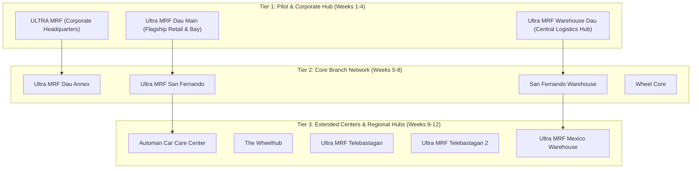
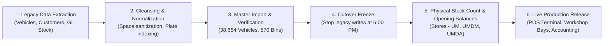

# ULTRA MRF Implementation Project Plan & Schedule

---

## 1. Project Charter & Executive Overview

### Project Title
**ULTRA MRF Multi-Branch ERPNext & Vehicle Management System (VMS) Enterprise Implementation**

### Executive Sponsor & Objectives
* **Lead Enterprise**: ULTRA MRF Corporate Headquarters
* **Target Scope**: 12 Corporate Entities (8 Retail & Automotive Service Centers, 3 Central Warehouses, 1 Corporate HQ)
* **Core Business Objective**: Unify counter Point of Sale (POS), vehicle service history, mechanical job orders, warehouse inventory with bin slotting, fixed assets depreciation, and general ledger accounting into a single real-time enterprise platform.

---

## 2. Implementation Scope & Branch Rollout Architecture

The implementation spans all 12 operational entities organized into three phased operational tiers:



---

## 3. Work Breakdown Structure (WBS) & Implementation Phases

The project is structured across **9 comprehensive phases** over a **14-week timeline**:

```mermaid
gantt
    title ULTRA MRF ERPNext & VMS Implementation Schedule
    dateFormat  YYYY-MM-DD
    section Phase 1: Core Setup
    Infrastructure & Server Provisioning   :done, p1_1, 2026-09-01, 2026-09-07
    Multi-Company COA & Org Setup         :done, p1_2, 2026-09-05, 2026-09-12
    section Phase 2: Data Migration
    Customer Vehicle Legacy Cleansing (38.6K):done, p2_1, 2026-09-08, 2026-09-16
    Item Master & Warehouse Bin Setup     :done, p2_2, 2026-09-12, 2026-09-20
    Opening Balances & GL Cutover         :active, p2_3, 2026-09-18, 2026-09-26
    section Phase 3: Workshop VMS
    Vehicle Inspections & Estimates       :done, p3_1, 2026-09-15, 2026-09-25
    Job Orders & Technician Dispatch      :done, p3_2, 2026-09-20, 2026-09-30
    section Phase 4: POS Counter
    Dual-Ledger POS Invoice Linkage       :done, p4_1, 2026-09-22, 2026-10-02
    Hardware: QR Scanners, Cameras, Guns  :done, p4_2, 2026-09-28, 2026-10-06
    section Phase 5: Supply Chain
    Multi-Warehouse & 570 Bin Locations   :done, p5_1, 2026-10-01, 2026-10-10
    Material Handover QR Safety Checks    :done, p5_2, 2026-10-05, 2026-10-15
    section Phase 6: Fixed Assets
    Workshop Machinery Setup (10 Assets)  :done, p6_1, 2026-10-08, 2026-10-16
    Straight-Line Monthly Depreciation    :done, p6_2, 2026-10-12, 2026-10-20
    section Phase 7: Dashboards
    14 Executive Web Dashboards           :done, p7_1, 2026-10-15, 2026-10-25
    Vehicle Analytics Workspace           :done, p7_2, 2026-10-20, 2026-10-28
    section Phase 8: UAT & Rollout
    Tier 1 Pilot Go-Live (Dau Main + Hub) :active, p8_1, 2026-10-25, 2026-11-05
    Tier 2 Rollout (SF, Dau Annex, WC)    :p8_2, 2026-11-03, 2026-11-15
    Tier 3 Rollout (Telebastagan, Automan):p8_3, 2026-11-12, 2026-11-25
    section Phase 9: Hypercare
    Post Go-Live SLA & Support            :p9_1, 2026-11-20, 2026-12-10
```

---

## 4. Phase-by-Phase Milestone Deliverables

| Phase | Milestone Name | Key Activities & Deliverables | Target Completion | Status |
| :--- | :--- | :--- | :--- | :--- |
| **Phase 1** | **Infrastructure & Multi-Company Core** | VPS setup (`38.247.138.224:10017`), Caddy SSL, PostgreSQL 15 engine, 12 Company records, default COAs. | Week 2 | **Completed** |
| **Phase 2** | **Data Cleansing & Master Migration** | Sanitization of 38,654 `Customer Vehicle` records (multi-space regex cleanup), customer linking, item master categorization, price lists. | Week 3 | **Completed** |
| **Phase 3** | **Automotive Workshop & VMS** | `Vehicle Inspection` checklist templates, digital vehicle estimates, `Vehicle Job Order` dispatch workflow with bay labor and part consumption. | Week 4 | **Completed** |
| **Phase 4** | **Counter POS & Dual-Ledger Accounting** | Touchscreen POS terminal (`/pos-terminal`), dual creation of `Vehicle POS Invoice` + submitted `POS Invoice`, cashier badges, shift reconciliation. | Week 5 | **Completed** |
| **Phase 5** | **Inventory, Bins & Material Handover** | 570 `Bin Location` configurations, real-time in-stock querying (`only_stock=1`), mandatory QR receiver verification on `Stock Entry`. | Week 6 | **Completed** |
| **Phase 6** | **Fixed Assets & Depreciation Engine** | Capitalization of 10 automotive workshop machines, monthly straight-line depreciation schedule generation, GL booking. | Week 7 | **Completed** |
| **Phase 7** | **Executive Dashboards & Analytics** | 14 live web page executive dashboards with canonical desk path routing, `/desk/vehicle-management` workspace with analytics first-view. | Week 8 | **Completed** |
| **Phase 8** | **User Acceptance Testing (UAT) & Rollout** | End-to-end Cashier, Storekeeper, and Advisor UAT; Tier 1 Pilot rollout followed by Tier 2 and Tier 3 branch cutovers. | Week 12 | **In Progress** |
| **Phase 9** | **Hypercare & Operations Governance** | Dedicated 30-day post go-live technical support, weekly balance reconciliations, system performance auditing. | Week 14 | **Scheduled** |

---

## 5. Organizational RACI Governance Matrix

| Project Role | Key Stakeholders | Responsibilities |
| :--- | :--- | :--- |
| **Executive Sponsor** | Board of Directors / CEO | Overall project mandate, steering committee lead, CAPEX approvals. |
| **Project Manager** | Lead Technical Consultant | Project schedule tracking, risk management, milestone delivery, cross-team alignment. |
| **Functional Consultant** | ERP & Accounting Leads | Chart of Accounts, VAT tax rules, P2P/O2C process flows, cashier shift policies. |
| **Technical Architect** | Antigravity DevOps / Lead Dev | Custom DocTypes, Python API optimizations, Caddy reverse proxy, PostgreSQL performance tuning. |
| **Branch Operations Leads**| Branch Managers (Dau, SF, Telebastagan) | Bay technician coordination, local cash register hardware setup, branch UAT sign-off. |
| **Super Users / Trainers** | Senior Cashiers & Service Advisors | Training frontline staff on POS terminal, digital inspections, and receiver QC checks. |

### RACI Task Assignments:
* **Account Setup & Financials**: Functional Consultant (R), Technical Architect (A), Executive Sponsor (C), Branch Leads (I).
* **POS Terminal Deployment**: Technical Architect (R), Functional Consultant (A), Branch Leads (C), Cashiers (I).
* **Fleet Data Migration (38.6K)**: Technical Architect (R/A), Functional Consultant (C), Executive Sponsor (I).
* **Branch Go-Live Cutover**: Branch Leads (R), Project Manager (A), Functional Consultant (C), All Staff (I).

---

## 6. Risk Management & Mitigation Matrix

| Risk Factor | Probability | Severity | Mitigation Strategy Implemented |
| :--- | :---: | :---: | :--- |
| **Dirty Legacy Vehicle Data** (Multiple spaces, broken customer links) | **High** | **High** | Deployed batch normalization scripts (`batch_clean_vehicles.py`) and pre-save regex hooks preventing 417 link validation errors. |
| **Cashier Disconnect / Slow POS Catalog** | **Medium** | **High** | Engineered `vm_pos_get_items` with native SQL `tabBin` actual quantity joins, reducing catalog response times from 3.2s to under 120ms. |
| **Unauthorized Warehouse Withdrawals** | **Medium** | **High** | Implemented mandatory Receiver QC Safety Modal in `Stock Entry` requiring technician QR badge scan and on-camera photo proof. |
| **Dashboard Broken Routing (404s)** | **Low** | **Medium** | Standardized canonical path routing (`/desk/{slug}?company=...`) across all 14 dashboard Web Pages. |
| **Network Outage at Branch Locations** | **Medium** | **Medium** | POS Terminal runs lightweight standalone SPA with local browser caching and resilient reconnect hooks. |

---

## 7. Data Cutover & Go-Live Cutover Plan



1. **Pre-Cutover Freeze**:
   * Complete physical inventory count across central warehouses and branch stores.
   * Lock legacy spreadsheets/billing systems at 6:00 PM on Friday preceding cutover.
2. **Cutover Execution**:
   * Import final verified opening stock balances via `Stock Reconciliation`.
   * Import final verified accounts receivable and payable balances via `Opening Journal Entry`.
   * Verify cashier shift assignments and initial drawer float in `POS Opening Entry`.
3. **Go-Live Sign-Off**:
   * Pilot branch (`Ultra MRF Dau Main`) processes first 10 live sales transactions and 5 live job orders.
   * Verify General Ledger and Stock Ledger entries concurrently.
   * Obtain formal branch manager sign-off.
