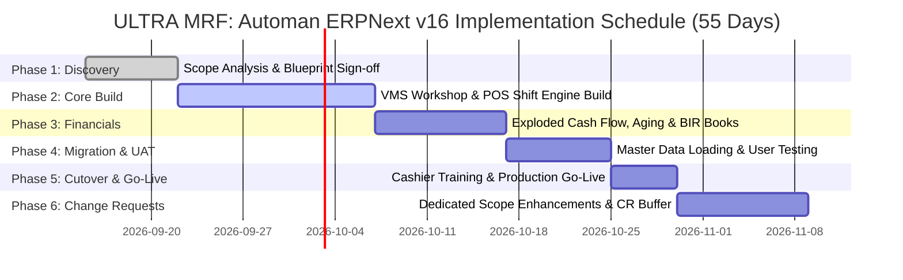

# Business Blueprint Document: ULTRA MRF: Automan
## Implementation of ERPNext v16 Enterprise with Vehicle Management System (VMS) & Consolidated Multi-Company Suite

**Prepared For:** ULTRA MRF / Automan Car Care Center  
**Prepared By:** Jose Mangiliman Jr. (Lead ERP Solutions Architect & Consultant)  
**Implementation Timeline:** 45 Working Days (Implementation) + 10 Working Days (Change Request Buffer) = **55 Days Total**  
**Date of Document:** 11th September 2026  
**Release Version:** v1.0 Production Baseline  

---

## 1. CHANGE HISTORY & DOCUMENT CONTROL

| Version | Date | Author | Description of Change |
| :--- | :--- | :--- | :--- |
| **v1.0** | 11 Sep 2026 | Jose Mangiliman Jr. | Initial release of Business Blueprint Document for ULTRA MRF: Automan ERPNext v16 + VMS rollout. |
| **v1.1** | 11 Sep 2026 | Jose Mangiliman Jr. | Integrated Exploded Horizontal Cash Flow (Year-Month-Day), 30/60/90 Day AR/AP Aging, and Multi-Company Consolidation. |

---

## 2. PROJECT INTRODUCTION & EXECUTIVE SUMMARY

This document serves as the formal **Business Blueprint (BBP)** for the design, development, configuration, data migration, and deployment of **ERPNext v16 Enterprise** integrated with the custom **Vehicle Management System (VMS)** for **ULTRA MRF: Automan**.

Automan Car Care Center and ULTRA MRF operate a multi-branch automotive repair, preventive maintenance, tire wholesale/retail, spare parts warehousing, and fleet care enterprise across 13 operating entities in Central Luzon.

### 2.1 Acceptance & Signatories

| Role | Name | Designation / Organization | Status |
| :--- | :--- | :--- | :--- |
| **Lead Solutions Architect** | **Jose Mangiliman Jr.** | Lead ERP Solutions Architect | Approved |
| **Project Sponsor** | Executive Management | Managing Director / ULTRA MRF | For Countersign |
| **Operations Lead** | Workshop Operations Manager | Automan Car Care Center | For Countersign |
| **Finance Lead** | Chief Financial Controller | ULTRA MRF Group | For Countersign |

### 2.2 Enterprise Operating Entities (13 Companies Matrix)

1. **Automan Car Care Center** (`ACCC`) — Automotive Service, Mechanical Repair, Quick Lube & Tire Center
2. **Ultra MRF Dau Main** (`UMDM`) — Central Headquarters, Fleet Maintenance Hub & Wholesale Parts
3. **Ultra MRF San Fernando** (`UMSF`) — Branch Service Center & Quick Lube Operations
4. **Ultra MRF Telebastagan** (`UMTB`) — Automotive Care, Tire Fitting & Wheel Alignment
5. **Ultra MRF Telebastagan 2** (`UMT2`) — Heavy Fleet Maintenance & Commercial Vehicles
6. **Ultra MRF Dau Annex** (`UMDA`) — Parts Warehousing & Overflow Distribution
7. **The Wheelhub** (`TWHB`) — Premium Wheels, Rims & Specialty Tire Retail
8. **Wheel Core** (`WCRL`) — Wheel Distribution & Wholesale Trading
9. **Ultra MRF** (`UMRF`) — Corporate Holding & Administrative Management
10. **Ultra MRF Warehouse Dau** (`UMWD`) — Central Logistics & Regional Parts Depot
11. **Ultra MRF Mexico Warehouse** (`UMMW`) — Bulk Tire, Lubricant & Battery Storage
12. **San Fernando Warehouse** (`SFWH`) — Regional Warehouse & Subcontracting Depot
13. **ULTRA MRF Group (Consolidated)** (`UMGC`) — Top-Level Consolidated Financial Reporting Entity

---

## 3. ABBREVIATIONS & GLOSSARY

- **VMS**: Vehicle Management System
- **VJO**: Vehicle Job Order
- **VE**: Vehicle Estimate / Quotation
- **VI**: Vehicle Inspection
- **VIN**: Vehicle Identification Number
- **POS**: Point of Sale Terminal
- **COA**: Chart of Accounts
- **GL**: General Ledger
- **P&L**: Profit and Loss Statement
- **BS**: Balance Sheet
- **AR**: Accounts Receivable
- **AP**: Accounts Payable
- **SLE**: Stock Ledger Entry
- **PCount**: Physical Inventory Count & Audit
- **BIR**: Bureau of Internal Revenue
- **EWT**: Expanded Withholding Tax (BIR Form 2307)
- **O2C**: Order-to-Cash Lifecycle
- **P2P**: Procure-to-Pay Lifecycle
- **RBAC**: Role-Based Access Control

---

## 4. BUSINESS REQUIREMENTS & ARCHITECTURE

### 4.1 Engagement Parameters
- **Implementation Window:** 45 Working Days
- **Change Request (CR) Buffer:** 10 Working Days
- **Total Usable Man-Days:** 55 Working Days
- **Concurrent Users:** 500 Supported Active Users
- **Hosting Environment:** Cloud VPS (Linux Ubuntu 24.04, Docker, Caddy SSL) at `http://38.247.138.224:10017`

### 4.2 Core Functional Modules

1. **Vehicle Operations & Workshop Management (VMS):**
   - Vehicle Intake & VIN/Plate Master Registration.
   - Comprehensive multi-point Vehicle Inspection (VI).
   - Dynamic Vehicle Estimate (VE) with automated parts compatibility filtering.
   - Vehicle Job Order (VJO) execution, mechanic QR badge scanning, and QA gate pass release.

2. **Point of Sale (POS) & Cashier Shifts:**
   - Multi-cashier shift management with POS Opening & Closing Vouchers.
   - Fast counter billing with multi-mode payment splitting (Cash, Card, GCash, Maya, Charge).
   - Automated Sales Invoice, Stock Ledger, and GL journal generation.

3. **Supply Chain, Warehousing & Bin Routing:**
   - Multi-warehouse inventory tracking across all 13 operating entities.
   - Automated Bin Location assignment (Aisle/Rack/Shelf).
   - Receiver Safety Check validation on all incoming purchase receipts.
   - Inter-branch stock transfers with 'In-Transit' status controls.
   - Physical Count (PCount) module with variance reporting and automated reconciliation.

4. **Multi-Company Financial Consolidation Suite:**
   - Consolidated Multi-Company Profit & Loss (P&L) Statement.
   - Consolidated Statement of Financial Position (Balance Sheet).
   - Multi-Company General Ledger Audit Trail Explorer.
   - Interactive multi-company popover filter with 'Select All' and individual branch checkboxes.

5. **Hierarchical Exploded Cash Flow Engine:**
   - Fixed activity rows: Beginning Cash Balance, Cash Inflows, Cash Outflows, Net Cash Flow, Ending Cash Balance.
   - **Horizontal Drilldown:** Clicking Year expands to 12 Months; clicking Month explodes to individual operating Days!
   - Instant switching between Consolidated Group and individual operating companies.

6. **Accounts Receivable (AR) & Accounts Payable (AP) Aging Engine:**
   - Evaluates outstanding balances based on **actual credit terms and invoice due dates**.
   - Standard 5-tier aging buckets: Current/Not Due, 1-30 Days, 31-60 Days, 61-90 Days, and 90+ Days Overdue.
   - Customer & Supplier summaries with instant invoice drill-down drawers.

7. **Philippine BIR Tax Compliance & Statutory Books:**
   - Automated BIR Form 2307 Withholding Certificate generation.
   - Real-time statutory journal books: Sales Book, Purchases Book, Cash Receipts Journal, Cash Disbursements Journal, General Journal, and VAT Return 2550.

---

## 5. 45-DAY IMPLEMENTATION + 10-DAY CHANGE REQUEST TIMELINE

| Phase | Duration | Key Milestone & Deliverables | Owner |
| :--- | :--- | :--- | :--- |
| **Phase 1: Discovery & Architecture** | Days 1 – 7 (7d) | Business Blueprint sign-off, Chart of Accounts, Multi-Company Matrix | Jose Mangiliman Jr. |
| **Phase 2: Core Build & VMS Customization** | Days 8 – 22 (15d) | DocTypes, VJO/POS workflows, Server Scripts, Print Templates | Jose Mangiliman Jr. |
| **Phase 3: Financials & Reports Suite** | Days 23 – 32 (10d) | Exploded Cash Flow, AR/AP Aging, BIR Journals, Consolidated P&L | Jose Mangiliman Jr. |
| **Phase 4: Data Migration & UAT** | Days 33 – 40 (8d) | Items, Vehicles, Customers, Opening GL upload, UAT execution | Jose Mangiliman Jr. & Team |
| **Phase 5: Training, Cutover & Go-Live** | Days 41 – 45 (5d) | Staff training, cashier dry runs, cutover to live production | Jose Mangiliman Jr. |
| **Phase 6: Change Request (CR) Window** | Days 46 – 55 (10d) | Dedicated scope buffer for custom requests and post-go-live tuning | Jose Mangiliman Jr. |

---

## 6. SIGN-OFF & BLUEPRINT APPROVAL

**Lead Solutions Architect:**  
Jose Mangiliman Jr.  
*Lead ERP Solutions Architect & Consultant*  
Date: September 11, 2026  
Status: **APPROVED & SIGNED**  

**Client Executive Management:**  
Managing Director / Chief Operating Officer  
*ULTRA MRF / Automan Car Care Center*  
Date: ________________________  
Status: **READY FOR COUNTERSIGN**  

---
*Document Reference: ULTRA_MRF_AUTOMAN_BBP_V1.0*
